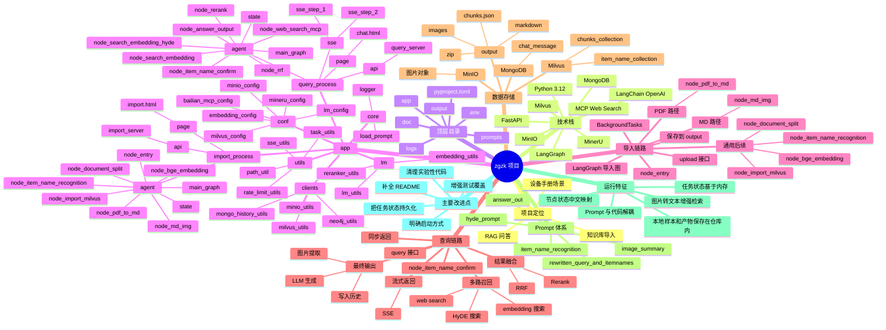

# 掌柜智库项目思维导图

下面的思维导图使用 Mermaid 编写，支持 Mermaid 的 Markdown 预览器可直接渲染。



## 文本版结构

```text
zgzk 项目
├─ 技术底座
│  ├─ FastAPI
│  ├─ LangGraph
│  ├─ Milvus
│  ├─ MongoDB
│  ├─ MinIO
│  └─ OpenAI 兼容模型服务
├─ 导入流程
│  ├─ 上传文件
│  ├─ PDF 转 Markdown
│  ├─ 图片理解
│  ├─ 文档切块
│  ├─ 主体识别
│  ├─ 向量生成
│  └─ Milvus 入库
├─ 查询流程
│  ├─ 问题改写与主体确认
│  ├─ 本地混合检索
│  ├─ HyDE 检索
│  ├─ 联网搜索
│  ├─ RRF 融合
│  ├─ Rerank 精排
│  └─ 大模型答案输出
├─ 存储体系
│  ├─ Milvus: chunk 与 item_name
│  ├─ MongoDB: 历史对话
│  ├─ MinIO: 图片
│  └─ output: 中间产物
└─ 工程支撑
   ├─ conf: 配置映射
   ├─ core: 日志与 Prompt 加载
   ├─ utils: SSE、任务、路径等工具
   └─ prompts: 提示词模板
```
